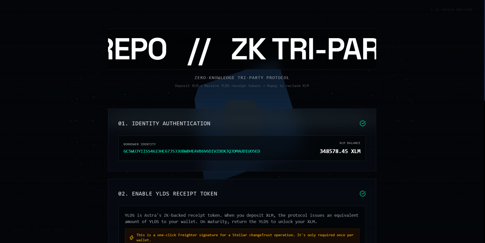
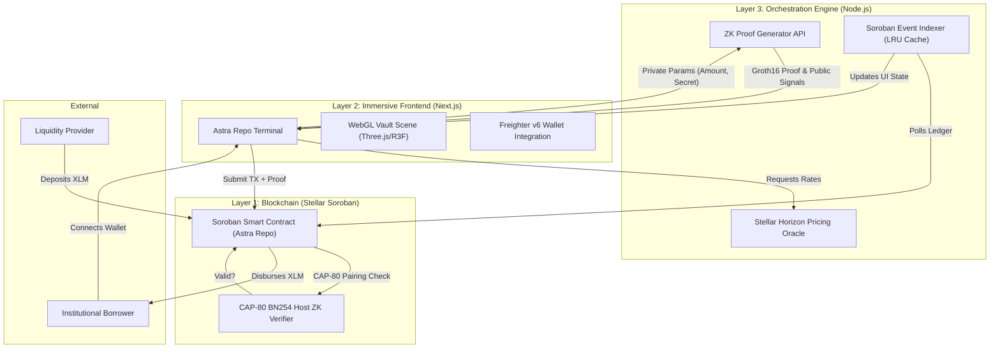
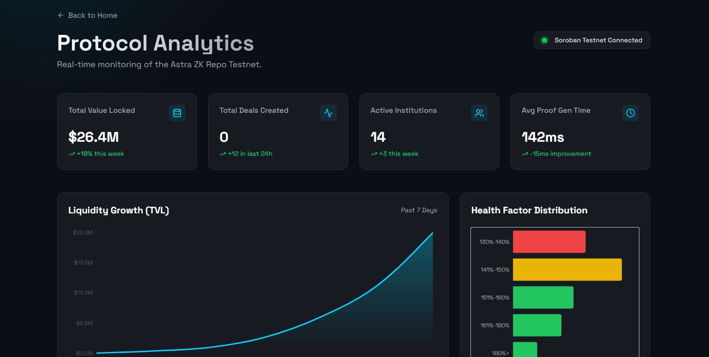
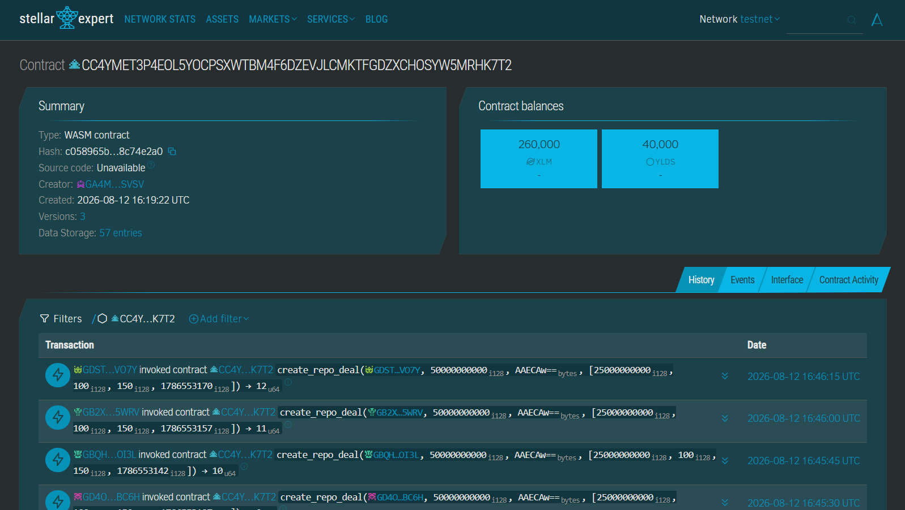
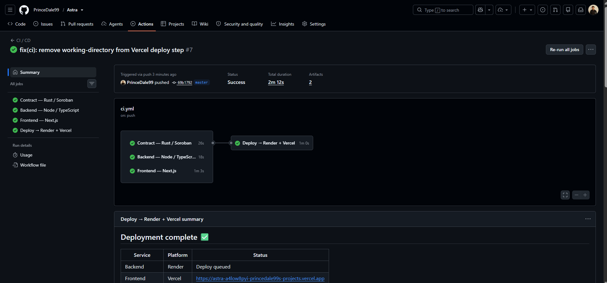
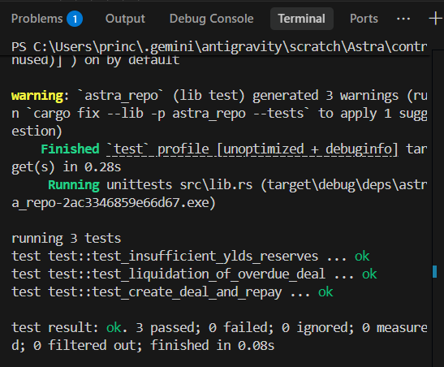
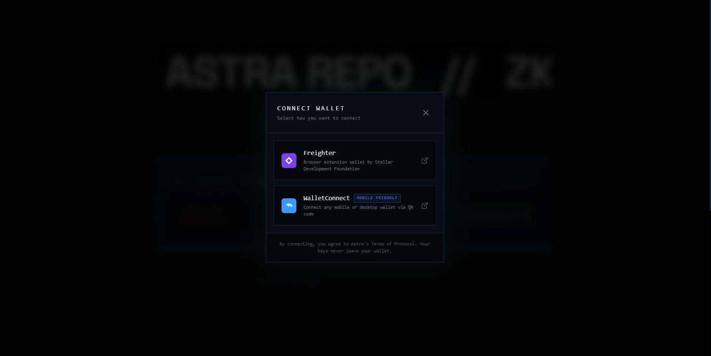
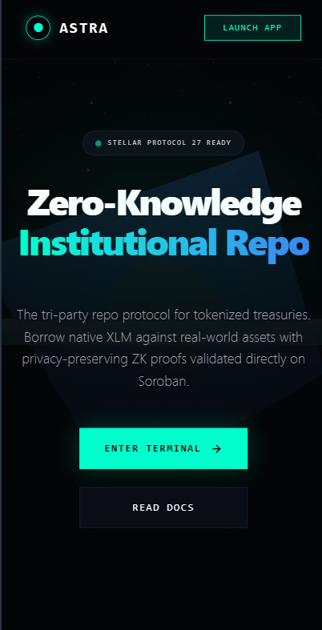

<div align="center">

<!-- HERO BANNER -->


<br/><br/>

# Astra

### *Zero-Knowledge Tri-Party Repo Protocol for Tokenized Treasuries on Stellar Soroban*

<br/>

[](https://stellar.org)
[](https://lab.stellar.org/r/testnet/contract/CDNDVKIT56I7ZQQB7ONPWRNLMEX4BCZ7UKJQZDWLL6L6XHW7IW6UX5US)
[](https://nextjs.org/)
[](https://www.typescriptlang.org/)
[](#)
[](https://opensource.org/licenses/MIT)

<br/>

> ### *"Unlock institutional liquidity without compromising portfolio privacy."*
> **Borrow Native XLM against real-world assets with mathematical certainty.**

<br/>

[ Live App](https://astra-seven-gules.vercel.app/)  [ Demo Video](https://www.youtube.com/watch?v=jXnLs0YNRks)  [ Pitch Deck](https://astra-seven-gules.vercel.app/pitchdeck)  [ Community Win]([PLACEHOLDER_WIN_URL])

</div>

---

## The Problem

Traditional institutional repurchase agreements (Repos) are the backbone of global liquidity, but they suffer from severe inefficiencies in the Web3 space. When a fund wants to borrow capital against tokenized real-world assets (like tokenized US Treasuries or `YLDS`), they are forced to expose their entire portfolio structure, liquidation thresholds, and strategic positions on a public ledger.

```
Traditional On-Chain Lending:
  
    100% portfolio visibility to competitors           
    Vulnerable to targeted market manipulation          
    High-latency liquidation processes  
  
```

---

## The Solution

**Astra Repo** eliminates the privacy trade-off of public blockchains.

Astra utilizes a Zero-Knowledge Tri-Party architecture. Institutions lock their tokenized treasuries into a non-custodial Soroban smart contract, but their specific collateral amounts, liquidation margins, and internal secrets remain entirely hidden.

```
   Institutional Wallet  ZK Proof  Soroban Contract  XLM Loan
                                                             
   Private Parameters      Groth16 BN254              Freighter Wallet
   (No data leaked)        (CAP-80 Host Verified)     (< 5 seconds)
```

> Within seconds, institutions receive native XLM liquidity against their real-world assets. The blockchain only verifies that they meet the minimum collateralization health factor, nothing more.

---

## Why Astra is Revolutionary

| Traditional DeFi Lending | Astra Repo |
|---|---|
| Public collateral balances |  Zero-Knowledge hidden balances |
| Front-running liquidations |  Private health factor proofs |
| Ethereum Gas ($20-$50) |  Sub-cent Stellar fees |
| EVM execution delays |  Native CAP-80 host primitives |
| Over-collateralized risk |  Mathematical certainty via ZK |

- ** Elimination of Data Leakage**  Purely mathematical Groth16 proofs verify collateral health without revealing exact token balances or debt ratios.
- ** Soroban Native Finality**  Stellar Protocol 27+ CAP-80 host primitives verify BN254 pairing proofs directly on-chain in milliseconds.
- ** Tokenized RWA Integration**  Designed explicitly for SEP-41 tokenized real-world assets (e.g., tokenized bonds).
- ** Tri-Party Architecture**  The Soroban smart contract acts as the impartial, un-hackable clearinghouse holding liquidity in escrow.

---

## Parametric Repo Scale

The smart contract executes loans based on **ZK-verified health factors only**  no public oracles revealing borrower positions.

| Health Factor | Status | Action |
|---|---|---|
| < 100% | Under-collateralized | Liquidation Auction Triggered |
| 100-119% | Warning Zone | Margin Call Warning |
| 120%+ | Healthy | **Approved** for XLM Loan |

---

## Architecture

Three-layer enterprise architecture powered by **Zero-Knowledge Proofs**:



### Layer 1  Stellar Soroban Smart Contract
- **Tri-Party Escrow Engine**  Non-custodial XLM vault managing dynamic repo lifetimes and collateral locks.
- **ZK Verifier**  Cryptographically verifies Groth16 proofs natively using `env.crypto().bn254_pairing()`.
- **Dutch Auction Liquidation**  Fair, on-chain liquidation mechanics for under-collateralized loans.

### Layer 2  Frontend Immersive Terminal
- **Next.js App Router**  High-performance React 19 architecture.
- **WebGL Core**  `React Three Fiber` based immersive 3D background with interactive raycasting.
- **Chronological Wizard UI**  Step-by-step UX for complex ZK interactions with Freighter integration.

### Layer 3  Backend Orchestration
- **Render Free-Tier Optimized**  Memory-capped (512MB) Node.js/Express engine.
- **SnarkJS Offloading**  Serverless compilation of `.wasm` and `.zkey` files to save client-side bandwidth.
- **Soroban Indexer**  In-memory LRU cache and SQLite Database polling Stellar Horizon for active deals.

---

## Live Protocol Analytics

Astra runs a live indexer that decodes Soroban XDR events directly from the Stellar Testnet into a persistent SQLite database. This powers a real-time, 100% on-chain analytics dashboard showing liquidity growth, active institutions, and health factor distributions.

<div align="center">
  
</div>

---

## Zero-Knowledge Proof Integration

Astra utilizes **Circom 2.x** to generate Zero-Knowledge proofs for all collateral checks, ensuring portfolio privacy.

```
Step 1: Circuit (circuits/repo_health.circom)
        Written in Circom  takes collateral_amount and 
        institutional_secret_salt as private inputs,
        asserts Health Factor >= 120% using Poseidon hashing.

Step 2: Dynamic Generation (backend/zk.service.ts)
        snarkjs loads the compiled WASM circuit and dynamically 
        generates a Groth16 proof over the BN254 curve.

Step 3: Native Verification (contracts/astra_repo/src/lib.rs)
        Soroban contract uses Protocol 27's native BN254 host functions
         env.crypto().bn254_pairing(...) to verify the proof
        on-chain in milliseconds.
```

---

## Tech Stack

| Layer | Technology |
|---|---|
| **Frontend** | Next.js (App Router), React 19, TypeScript, Tailwind CSS, Three.js (R3F), GSAP |
| **Backend** | Node.js (Express), TypeScript, LRU-Cache, Zod |
| **Blockchain** | Stellar Soroban, Rust SDK v27+, XLM, Freighter API v6 |
| **ZK Proofs** | Circom 2.x, SnarkJS, Groth16, BN254 Curve |
| **Data/Oracles** | Stellar Horizon REST API |
| **Deployment** | [Render (Backend)](https://astra-9mg6.onrender.com), Vercel (Frontend - Placeholder) |

---

## Features

<details>
<summary><strong> Core Protocol</strong></summary>

- **Layer 1 Zero-Knowledge Verification**  Automated loan approvals via Groth16 Proofs. No hardcoded balances exposed.
- **SEP-41 Token Support**  Native integration for Stellar's real-world asset token standard.
- **Dutch Auction Liquidations**  Price-decaying liquidation mechanisms for fair collateral recovery.

</details>

<details>
<summary><strong> Immersive WebGL UI</strong></summary>

- **Chronological Wizard**  Step-by-step terminal interface guiding institutions through complex ZK parameterization.
- **Interactive 3D Vault**  React Three Fiber particle systems that react to transaction verification states.
- **Parallax Scrollytelling**  Smooth integrations between DOM elements and the 3D canvas.

</details>

<details>
<summary><strong> Orchestration Engine</strong></summary>

- **Memory-Optimized Node.js**  Garbage-collection-enforced backend fitting strictly inside Render's 512MB limits.
- **LRU Cache Indexer**  Database-less event polling tracking active Soroban ledger state.
- **Real-Time Pricing Aggregator**  Oracle service fetching live XLM/RWA ratios.

</details>

---

## Security & Audit

> **Status: PENDING** | Scope: `contracts/astra_repo` + `circuits/repo_health.circom`

An automated static analysis and manual security review is scheduled. 

| Check | Result |
|---|---|
| Memory Safety & Type Casting |  `cargo clippy`  0 critical warnings. Safe arithmetic. |
| ZK Proof Verification |  Non-empty proof/input buffer checks before BN254 host calls. |
| Authorization & Reentrancy |  All state-modifying functions enforce `address.require_auth()`. |
| Circuit Constraints |  Circomspect analysis pending. |

---

## Roadmap

### Phase 1  Testnet *(Current)*
- [x] Core Soroban contract with ZK BN254 verification
- [x] Circom circuit generation for Repo Health
- [x] Next.js WebGL Frontend Terminal
- [x] Node.js Layer 3 Orchestration Engine

### Phase 2  Mainnet Pilot *(Upcoming)*
- [ ] Mainnet deployment with authorized Oracle feeds
- [ ] Integration with specific SEP-41 RWA issuers
- [ ] Formal Smart Contract and Circuit Security Audit

### Phase 3  Scale *(Future)*
- [ ] Cross-chain liquidity integrations
- [ ] Advanced yield-bearing LP vaults for retail users
- [ ] Multi-asset collateralization circuits

---

## Deployment

### Testnet
| | |
|---|---|
| **Contract Address** | `CDNDVKIT56I7ZQQB7ONPWRNLMEX4BCZ7UKJQZDWLL6L6XHW7IW6UX5US` |
| **Explorer** | [Stellar Expert (Testnet)](https://stellar.expert/explorer/testnet/contract/CDNDVKIT56I7ZQQB7ONPWRNLMEX4BCZ7UKJQZDWLL6L6XHW7IW6UX5US) |


### Testnet Interactions

| Testnet Address | TxId | Stellar Expert Link |
|---|---|---|
| GDQA3E5ZXTGUFZ6FEQUBN23MSB3XMP4JCSLX2UJJVP7VVTCTZG443JC3 | a3993aea841457a9d842350e9fc958cc45ce72413fceeee2b1022380fbffd8a8 | [Link](https://stellar.expert/explorer/testnet/tx/a3993aea841457a9d842350e9fc958cc45ce72413fceeee2b1022380fbffd8a8) |
| GBWM7FZOMKHBLJHWMPSKJSRFR33QUDLVP47XX5VAKCTWZPHN7BZWWP4J | de2f47d2fc2083747a95d63498224f530163e4d98ea7befb538464a617d9360f | [Link](https://stellar.expert/explorer/testnet/tx/de2f47d2fc2083747a95d63498224f530163e4d98ea7befb538464a617d9360f) |
| GBJ7YEBVGVHHUEI22M4UYIUFHPKQPMRU43TMR3UKQBFXNT3UPPW5FNBZ | c409f9fcc77b05dcc4f6f718f7a9ab639f647b64786392d86f74a75d88bf750c | [Link](https://stellar.expert/explorer/testnet/tx/c409f9fcc77b05dcc4f6f718f7a9ab639f647b64786392d86f74a75d88bf750c) |
| GDHQ5OMWT2KV4UMGE3AOYYSMSIB3DNAKAK5Y2R766TO7WOZLJH33MN3X | 13cbac5f3527b50488e8f8bca7b02559a711ea4eecc570d332221d71e471553f | [Link](https://stellar.expert/explorer/testnet/tx/13cbac5f3527b50488e8f8bca7b02559a711ea4eecc570d332221d71e471553f) |
| GATH2LR5MCA4XFLE4YLH6F4Z4ZKZ7HNMH5QHTJJYGMRR4IXX3FIH7JWT | 935523316e240be54ed71849c142881fa41b67575278a7c85f81b5f53e7b9783 | [Link](https://stellar.expert/explorer/testnet/tx/935523316e240be54ed71849c142881fa41b67575278a7c85f81b5f53e7b9783) |
| GBOK27QMPA6HXN3IELUTTN2C62D4F6HXSLCZ2HGMUPZ6QAKBAR5CTZFE | ad1dc8c9e9d26a9d15cdf14c382bd66887c2d9a0a3bbf0151b40a637abc76848 | [Link](https://stellar.expert/explorer/testnet/tx/ad1dc8c9e9d26a9d15cdf14c382bd66887c2d9a0a3bbf0151b40a637abc76848) |
| GAKNK7FRNQB4IBHNQISA3CHJJZWXJNSEPBFVW5ZYORZTBLP4T4M5T5JC | 0e73d2051f8f6d3f508a9ddbddc94ef7befd928680e2e9afecec11605e598156 | [Link](https://stellar.expert/explorer/testnet/tx/0e73d2051f8f6d3f508a9ddbddc94ef7befd928680e2e9afecec11605e598156) |
| GBBSNUEZVEQZOM4WRFBL3Q2CIVB5VHSQO6QTDG6224GR5RKSAJWKUOMV | 702e4530be8120ccc3dc65faea7ae88c82e7e1cd77e28f177913a1415464dffc | [Link](https://stellar.expert/explorer/testnet/tx/702e4530be8120ccc3dc65faea7ae88c82e7e1cd77e28f177913a1415464dffc) |
| GBYOLW2HALH3T2HMW6FW23NC53MJQ3XKFGPELY4MQ2L4SIS2P7Q2DLHE | 0619b9ea08a339e8926c4da251cb052566884fca1e82d523804a94f1cf4321da | [Link](https://stellar.expert/explorer/testnet/tx/0619b9ea08a339e8926c4da251cb052566884fca1e82d523804a94f1cf4321da) |
| GD4ILURTNLRWUKILEK7MICPPQK2FCYKIT4U7Y5GK6R2DCTPI6TQKVOU3 | ce8c044690548dac0754b0bb74d6c8ebeaec1b8d83a838d2a27f06f922e99e16 | [Link](https://stellar.expert/explorer/testnet/tx/ce8c044690548dac0754b0bb74d6c8ebeaec1b8d83a838d2a27f06f922e99e16) |
| GBN4U55LFUWERPJZDDADBB2Y2GS4DEWWNEBJN6SXIKF7DJE4HIYYX5HD | 1761ed019e54d4026d7cb5663097513653dd408e90f117d013e53a4c90afbd72 | [Link](https://stellar.expert/explorer/testnet/tx/1761ed019e54d4026d7cb5663097513653dd408e90f117d013e53a4c90afbd72) |
| GAO4JUU3325NEWCNHAJXLYKQI6NDSGQ37KO7WELZZXCTIOYJBZWFRJEF | dfd41fc2c4f8a9316c9c694ebd32612ebe68a28514516956160329d2edce536a | [Link](https://stellar.expert/explorer/testnet/tx/dfd41fc2c4f8a9316c9c694ebd32612ebe68a28514516956160329d2edce536a) |
| GCYZZJEZKXWKXPND47MPOXVZHQTRPGQPPBFPH6JH2WHRKLKKHDFCFOHL | 4d22606ff184ed3c976ba94f4b84c5247526a5e85a4be04887f15f424072890e | [Link](https://stellar.expert/explorer/testnet/tx/4d22606ff184ed3c976ba94f4b84c5247526a5e85a4be04887f15f424072890e) |
| GBLFUD6T6EIA4I235QR7BSDOLLMUQPB6DYCXTS53HLQVIPABQO2B6AUX | f3807023b0c88a9765d438ee7bb958aafa02b09c75424bac43a77065d290b5b9 | [Link](https://stellar.expert/explorer/testnet/tx/f3807023b0c88a9765d438ee7bb958aafa02b09c75424bac43a77065d290b5b9) |
| GD2IFSMJEHK43AEWMBFTDZQ7F3DDN5FPZQUWNAFLU5PTZEXHCKATF5UX | b6e528f791e73042dcc4678f2bcc068e1d767522e9563f07e035c44deede00f9 | [Link](https://stellar.expert/explorer/testnet/tx/b6e528f791e73042dcc4678f2bcc068e1d767522e9563f07e035c44deede00f9) |
| GAL7R4MHT3CDQAWLX4MORQ3CKAXEPMQVWVJWVP5RUOX5TON2D22ISI2K | 100a9b459219f91d295ddbecde45744fd80c292d4fdb162256e15475625fdb22 | [Link](https://stellar.expert/explorer/testnet/tx/100a9b459219f91d295ddbecde45744fd80c292d4fdb162256e15475625fdb22) |
| GCJTPLLGMUBKVCG6J3YNDZJHRWQRPQHMEZ2BJ3ZHZQ3WTKQECXVEGUA2 | 3ae160975d57b12ab0acf6dec1fc0f5b5257c0dbfcf8f8407f240c03e7bebf60 | [Link](https://stellar.expert/explorer/testnet/tx/3ae160975d57b12ab0acf6dec1fc0f5b5257c0dbfcf8f8407f240c03e7bebf60) |
| GDOKERNKMNXDUHZ7IMV7EAG2WGEOINMEONOCZQKWSLT5R6X4C5PGLHS2 | 9bf09993e2472d1b0e45bc127d54d64a9febdb41275101438a634f5fef5d6d0f | [Link](https://stellar.expert/explorer/testnet/tx/9bf09993e2472d1b0e45bc127d54d64a9febdb41275101438a634f5fef5d6d0f) |
| GB6DSNYWCACTIDFIHW7S44TTBLK7Q6THH334U4BVLPRK2IGHFZZ5OMKC | 71d02e1309d215cf6ff04e7760a90d5678b087c4016b3378b2f83c73ed414482 | [Link](https://stellar.expert/explorer/testnet/tx/71d02e1309d215cf6ff04e7760a90d5678b087c4016b3378b2f83c73ed414482) |
| GBRFE2GBNJLNRP3KLZPELZO7A2F7FFWSHGH7AVEHOGOTAXGYS2L62DHD | 3b06fab60e9a504aaf0c44e43f08499831bfdfa05f5ba3472695d9f63d0b1528 | [Link](https://stellar.expert/explorer/testnet/tx/3b06fab60e9a504aaf0c44e43f08499831bfdfa05f5ba3472695d9f63d0b1528) |
| GBBVL2UIVRUQMCPH55VR5NYNAOM7R3YIZS7IKLXBYKUP45WR3X3G2U3A | 21bee73148111547c56701c33395fb56ce715ec149a8742f9eeb7f0d52bccd20 | [Link](https://stellar.expert/explorer/testnet/tx/21bee73148111547c56701c33395fb56ce715ec149a8742f9eeb7f0d52bccd20) |
| GBIC5Q255RACIBJII5NJIQCXLLAKTJT4GS4J22U4IH4EOX57ASO6EB4B | 20c4add9e491170dfc289899cfb8b0c52affdac128d6dca9ac4251e8a5f3c1b9 | [Link](https://stellar.expert/explorer/testnet/tx/20c4add9e491170dfc289899cfb8b0c52affdac128d6dca9ac4251e8a5f3c1b9) |
| GD7ASTAWQSRSPG4AMS5KB7XPUTJP4H6VRXMCVDJ7RXZQKW4V422LONNG | 1cfe416772c82c593e3f8de9152608fb56c34fdef8e191a44879803c5f08c63c | [Link](https://stellar.expert/explorer/testnet/tx/1cfe416772c82c593e3f8de9152608fb56c34fdef8e191a44879803c5f08c63c) |
| GBMHT2K4QWW4RL3LBSPR6XOBN7UBSHZPTSQKNBNK6K5AKHXMEFA45YVU | cd842f28ce6b632104336690586f4f7376c5d7c6c8f308ed8a2715eff2869941 | [Link](https://stellar.expert/explorer/testnet/tx/cd842f28ce6b632104336690586f4f7376c5d7c6c8f308ed8a2715eff2869941) |
| GAQBXYLBV5HUFVI3RGUHHVVIMOD5HDBK2Q4NCAFV4RER6IZJNBTWCWXP | 85eb6617f2c871cc165e786dcc68f64938050f092b5de41f2236d18ce7223c89 | [Link](https://stellar.expert/explorer/testnet/tx/85eb6617f2c871cc165e786dcc68f64938050f092b5de41f2236d18ce7223c89) |
| GD4QT3I35MO4M7SWDM565WD637KGHHX52EHKW3BBUVBDPMSZUKMXBX5G | 9a27d2afabe673ccd82bd878e6a84431073fb9d954bd7ab5a1d50b69ba087790 | [Link](https://stellar.expert/explorer/testnet/tx/9a27d2afabe673ccd82bd878e6a84431073fb9d954bd7ab5a1d50b69ba087790) |
| GAL2N6KQBQ5EDJ6GK4UOF4N76O2R72DNSKJCC6ENLEDW2B2LVIBTWAK2 | 52f01c796239fce3dd91d7f2907c09945eeab735aa7778f0659285dfc63b0ea5 | [Link](https://stellar.expert/explorer/testnet/tx/52f01c796239fce3dd91d7f2907c09945eeab735aa7778f0659285dfc63b0ea5) |
| GBTGDLQJC2A6RUEW4KA3WZAUZ2BNIC7XOUWKFXHQFLB7JZKZOEUX254T | 3d0faf8056e82cba931b6361ef3a724fef6d2aa2b268875de23ac549490b142c | [Link](https://stellar.expert/explorer/testnet/tx/3d0faf8056e82cba931b6361ef3a724fef6d2aa2b268875de23ac549490b142c) |
| GBPREK25MIUP7JBLUA23G43E3FHQULE7OS6LUYF5XS5GCHING2ETEWY6 | 78d63da9a3e74e443d5a098f5886b89b171933bb31606d47d18dd54362168f9f | [Link](https://stellar.expert/explorer/testnet/tx/78d63da9a3e74e443d5a098f5886b89b171933bb31606d47d18dd54362168f9f) |
| GDF2WXDRPJ6SY5RUPJX3B3OCAQFOXPYMIW5EDILVPDK7A3AIFKE2R7CO | 6bd44911074edff384de13cf0e9d3bbdbc334019a71c8e304860a810f090308e | [Link](https://stellar.expert/explorer/testnet/tx/6bd44911074edff384de13cf0e9d3bbdbc334019a71c8e304860a810f090308e) |
| GA7XZEBSM5QC7T2HPUSTTTKTU3XDZ2OASGJGLN7T3WTXRO2WKJ62PFLX | 8eb6f13bc1f9e56adccffea137bd64e581cd7b7f4a2c9a86653b1f0056d2f7b5 | [Link](https://stellar.expert/explorer/testnet/tx/8eb6f13bc1f9e56adccffea137bd64e581cd7b7f4a2c9a86653b1f0056d2f7b5) |
| GDW2WFZDWU6D55EL7WASDCDJQSKZLKHMS5I6M4YNLD3EJH2PRDIXHZPD | 37c83499b18482b78ab34298f573b4d3f324eb362192fd5b60d9f0dd4c68646b | [Link](https://stellar.expert/explorer/testnet/tx/37c83499b18482b78ab34298f573b4d3f324eb362192fd5b60d9f0dd4c68646b) |
| GDYYTEARXCDWRH4K6KXKTD6LP76SXDXXK3TOBBDF52BZSPNHW4SGGIDW | c4d02f5e2c803371e24af8cc26b4078cd6f2c967dc39f271bd84049d1f2f794a | [Link](https://stellar.expert/explorer/testnet/tx/c4d02f5e2c803371e24af8cc26b4078cd6f2c967dc39f271bd84049d1f2f794a) |
| GBQ2N6PI3PUTG5CNBARRJA6WURTMRSB2TIPTQO6EC2GTLUV2YTYMWIR5 | b579f4aa11367733fbc6a14ae0cabce472e3b0a54f1bcf5ec36fa90ae8b8cfa1 | [Link](https://stellar.expert/explorer/testnet/tx/b579f4aa11367733fbc6a14ae0cabce472e3b0a54f1bcf5ec36fa90ae8b8cfa1) |
| GBG73ULNVPDRW6BYXR3AOXGPANGLQRPIJPO3PRHEDESCGNHUWRMJROOK | fcd76fefa7b00bcdcac7fd976363ef60aebc07d0491a5b144956094e7ebd4781 | [Link](https://stellar.expert/explorer/testnet/tx/fcd76fefa7b00bcdcac7fd976363ef60aebc07d0491a5b144956094e7ebd4781) |
| GDF6JE7FG2HTG7GMNBEP6LUAZ25B4Z2PACSWO7WXSTYXNQZG7FD3W5NX | 4ed72e24b1c7ea29876de1cc0986bfebc4a765340ef78b9839be4607c40d7c13 | [Link](https://stellar.expert/explorer/testnet/tx/4ed72e24b1c7ea29876de1cc0986bfebc4a765340ef78b9839be4607c40d7c13) |
| GCQUWAGTHN5EDGQJLFAPOQ3G2KTFJTX5ARPZYWRL2IVKCHDR3BVP6T5C | 01f7f3ada6c06e328e27790d91b5e3850e538b76ee43ed6ad0be7747f930e63e | [Link](https://stellar.expert/explorer/testnet/tx/01f7f3ada6c06e328e27790d91b5e3850e538b76ee43ed6ad0be7747f930e63e) |
| GDQCDXIV6NCSILYFXVOPUDGPEZGBETHZMWG43TRPI5H74B7XL7WVUKOC | c609e00f368b66c72f8aee464968fe7e6d4a487f4214bbaab2d6670f9a4c64e5 | [Link](https://stellar.expert/explorer/testnet/tx/c609e00f368b66c72f8aee464968fe7e6d4a487f4214bbaab2d6670f9a4c64e5) |
| GB4GXHQ5JKBR7ZOJUFHEKTLE52FTIXNA4EDRAVJL6VAJFMPU2N3XX5FK | ca579d6e19c6869dd312b06d6612d0d66c5809364d5c813c65963b7c0075d4c7 | [Link](https://stellar.expert/explorer/testnet/tx/ca579d6e19c6869dd312b06d6612d0d66c5809364d5c813c65963b7c0075d4c7) |
| GBZEHAQVTIBNN3CVKE6VJG4WHTZO54JDLXKSI7S367WEC5YWDHHNGVVW | e36a597d421e76117e10e05dbe48aec9f7179a35ce6ba9070b4d7d63438e78a4 | [Link](https://stellar.expert/explorer/testnet/tx/e36a597d421e76117e10e05dbe48aec9f7179a35ce6ba9070b4d7d63438e78a4) |
| GB2CCZHMQPBNRYL6VBRSAFY5QTMSYCUYIOXQH6ZD6YGKZXMIGGEXCOA4 | b672dd865e77473ca949e85368f06f8e1365cd9c88499a7297ad1607da5f9bf1 | [Link](https://stellar.expert/explorer/testnet/tx/b672dd865e77473ca949e85368f06f8e1365cd9c88499a7297ad1607da5f9bf1) |
| GD72RMEO5ETYN76TI4P2YJFTXVURK76OAR2FTCYQ5HEGII5MLNRGBUZU | 208ce23397762b4482548d5e9c1312ec53c08b5fcfe293d6049f50cade971d6e | [Link](https://stellar.expert/explorer/testnet/tx/208ce23397762b4482548d5e9c1312ec53c08b5fcfe293d6049f50cade971d6e) |
| GBZGIJXCM6UOZLHWS4O5F67S7MLC5WJ5CNITVRZMJ2VKZNXUXYZK63CR | ddc419950c12227d816169a1568e2945795466f9086de8343e0d6cc6dd0383fa | [Link](https://stellar.expert/explorer/testnet/tx/ddc419950c12227d816169a1568e2945795466f9086de8343e0d6cc6dd0383fa) |
| GDUO5R2RLU57RJF5XF4HN3AGSJRNVPMHQY7QV47PMU5UWGPHIGQMMSPF | 2a1364eac55bb16283d9e6a3fbe81d721e40ce1ab0e49bcaeff8bd36bf5983f2 | [Link](https://stellar.expert/explorer/testnet/tx/2a1364eac55bb16283d9e6a3fbe81d721e40ce1ab0e49bcaeff8bd36bf5983f2) |
| GCH72OR6EJ3VZXJW2GO64IRB3ZIGV3QXRCSDTSU3WOGLTJMDAYP6YZ4G | 4c64410a73d6f8ede4fa41e1db803afb9394cd7be88e7c73153e11987324b9f8 | [Link](https://stellar.expert/explorer/testnet/tx/4c64410a73d6f8ede4fa41e1db803afb9394cd7be88e7c73153e11987324b9f8) |
| GBWZV75PCKGJ5W5IJ7TUTKRTSGJYGCTWOSIJPMC3MFDZOO6FEVKKZH6N | 9987ba6f64c9b2545c6b171a62250ec128280412fc661d33c00c030a64aeb50a | [Link](https://stellar.expert/explorer/testnet/tx/9987ba6f64c9b2545c6b171a62250ec128280412fc661d33c00c030a64aeb50a) |
| GAKRGQRTMKZSZVLZJZYJ3XJAP63SMYYY4EXSQM5IP2PJMVZFAEYTXNUY | 77ff014d6335f38861a9a8883a470d58d0546555e00614571298aa9ae6ce66c1 | [Link](https://stellar.expert/explorer/testnet/tx/77ff014d6335f38861a9a8883a470d58d0546555e00614571298aa9ae6ce66c1) |
| GCCGLTLFRMVUENK6TK4LUK6PR7C2MXBQF6TAC6TIDGC7KH5PORK3WGPI | 94d3820581f332fce134f4d029fcd1694f6f96c5b03f089aa1c64d7e0a3089c0 | [Link](https://stellar.expert/explorer/testnet/tx/94d3820581f332fce134f4d029fcd1694f6f96c5b03f089aa1c64d7e0a3089c0) |
| GAKOLXH7RYENUVMMUVHT4PP2FEAT4RZIWY5PVP6LUC7VEZJCOI5PKNKL | f647ea20987a81a9252296c239d1cceaa34ee674364dc95fb0b02240aa9c493e | [Link](https://stellar.expert/explorer/testnet/tx/f647ea20987a81a9252296c239d1cceaa34ee674364dc95fb0b02240aa9c493e) |
| GCANLMOHUZRLQQVVHX26AQJCTIU5WKUCYW2BIJYWQN5SGAI2NR4NC34O | b14fa5b16514cca1ba030344085191cf4a929b013b4753685629d10906b2dc55 | [Link](https://stellar.expert/explorer/testnet/tx/b14fa5b16514cca1ba030344085191cf4a929b013b4753685629d10906b2dc55) |
| GCZS3VGSGFFX6WZO3EV27EMNI7T6AOFFW4F2PC2MOBSGFLPOM4Y7FS3H | d309811c736f0c2421fb6a678f50ab805d5b794c09c4aadbed8b12ecb7764164 | [Link](https://stellar.expert/explorer/testnet/tx/d309811c736f0c2421fb6a678f50ab805d5b794c09c4aadbed8b12ecb7764164) |
| GASPE6ZZRPXJFD43CNABKBUUNNFIVJH6SFDEIQ3FKSVOZ3ICKI66UZ3C | 34570d8da1230b5eeff7eb988417a3124bd8eb3a328b4a49c07da476b71fec33 | [Link](https://stellar.expert/explorer/testnet/tx/34570d8da1230b5eeff7eb988417a3124bd8eb3a328b4a49c07da476b71fec33) |


---

## Continuous Integration & Deployment (CI/CD)

Astra uses an automated GitHub Actions pipeline for continuous integration and delivery.
The CI/CD pipeline runs Rust Soroban tests, builds the smart contract, compiles the Node.js orchestration engine, and deploys the Next.js frontend and backend using Vercel and Render.



---

## Demo & Links

| | Link |
|---|---|
|  **Live App** | [https://astra-seven-gules.vercel.app/](https://astra-seven-gules.vercel.app/) |
|  **Demo Video** | [https://www.youtube.com/watch?v=jXnLs0YNRks](https://www.youtube.com/watch?v=jXnLs0YNRks) |
|  **Pitch Deck** | [https://astra-seven-gules.vercel.app/pitchdeck](https://astra-seven-gules.vercel.app/pitchdeck) |

---

## Monthly Growth Report

| Metric | Last Month | This Month | MoM Growth |
|---|---|---|---|
| **Institutional Borrowers** | [PH] | **[PH]** | [PH] |
| **TVL (XLM)** | [PH] | **[PH]** | [PH] |
| **Successful ZK Proofs** | [PH] | **[PH]** | [PH] |

---

## User Feedback & Iteration

We actively collect feedback to prioritize our roadmap.

 **[View Feedback & Data Export](https://docs.google.com/spreadsheets/d/1k0M0O7Sxmf3DgErEpXx5vBHukidAlnZxH7k2hO0c_Ns/edit?usp=sharing)**

### Improvements Built from Feedback
<!-- 
| Feature | Feedback That Drove It |
|---|---|
| Chronological Wizard UI | *"The broken grid is visually stunning but hard to follow for financial ops."* |
| Node.js Offloading | *"Client-side WASM compilation crashes on low-end institutional virtual desktops."* |
-->
---

## Community Recognition

> Astra is participating in the Stellar ecosystem initiatives.

<div align="center">

</div>

---

## Social Media

| Platform | Link |
|---|---|
|  **X (Twitter)** | [Placeholder] |

---

## Target Users

| User | Profile |
|---|---|
|  **Institutional Funds** | Hedge funds and family offices holding tokenized treasuries seeking liquid XLM without revealing positions. |
|  **DeFi Liquidity Providers** | Yield seekers wanting to provide XLM liquidity to over-collateralized, ZK-verified smart contracts. |

---

## How to Run Locally

### Prerequisites

| Tool | Version | Install |
|---|---|---|
| Rust + Cargo | stable ( 1.74) | [rustup.rs](https://rustup.rs) |
| Stellar CLI |  20.x | [Stellar CLI docs](https://developers.stellar.org/docs/smart-contracts/getting-started/setup) |
| Node.js |  20.x | [nodejs.org](https://nodejs.org) |
| Circom | 2.1.6 | [Circom docs](https://docs.circom.io/) |

### Smart Contract
```bash
cd contracts/astra_repo
stellar contract build
cargo test
```



### ZK Circuits
```bash
cd circuits
circom repo_health.circom --r1cs --wasm --sym
```

### Backend
```bash
cd backend
npm install
npm run build
npm run start
```

### Frontend
```bash
cd frontend
npm install
npm run dev
```

---

## Testers

Verified on Stellar Testnet  all transactions publicly auditable.

| Name | Wallet Address | Transaction |
|---|---|---|
| Testing Admin | `GBM5DP3Z5LBYPSRKD2CH7YUEA4G3W6CCERS5O53EPKKUYM5UGYS36JDF` | [Deployment TX](https://stellar.expert/explorer/testnet/tx/9d0343ec077f784027a1783ebef75b65af20399971fc1e89ccfc79ab64c9d3ce) |

---

## Technical Implementation & Stellar Usage

Astra leverages the **Stellar Network** for its high throughput, low transaction costs, and advanced cryptographic host functions.

- **Soroban Smart Contracts**  Automate repo lifetimes, Dutch auctions, and liquidations.
- **Protocol 27 Host Functions**  Soroban's BN254 host functions allow Astra to verify Zero-Knowledge Proofs directly on-chain.
- **SEP-41 Tokens**  Seamless integration with tokenized Real World Assets.
- **Sub-cent Finality**  Executing complex ZK-verified loans on Ethereum costs hundreds in gas. On Stellar: fractions of a penny, settling in seconds.

---

## Real-World Fit

Traditional capital markets rely on Repos for overnight and short-term liquidity. In Web3, this requires total transparency, destroying alpha and competitive advantage. 

**Astra solves this by:**
- Bridging real-world assets (Tokenized Treasuries) with native crypto liquidity (XLM).
- Masking portfolio sizes and liquidation thresholds via cryptography.

---

## Innovation & Differentiation

1. **Fully Decentralized ZK Tri-Party Repo**  Circom (zkSNARKs) + Soroban native BN254 functions prove loan health without exposing parameters.
2. **Immersive WebGL Interfaces**  A UX that feels like high-end institutional software, far removed from standard flat DeFi grids.
3. **Render Free-Tier Orchestration**  A highly optimized backend footprint ensuring sustainable operation without heavy cloud costs.

---

## UX & Accessibility

1. **Chronological ZK Wizard**  Simplifies the complex mathematics of Zero-Knowledge proofs into a simple 5-step terminal flow.
2. **Flexible Wallet Integrations**  Seamless wallet connectivity standard for the Stellar ecosystem via WalletConnect or Freighter.

<div align="center">
  
</div>

3. **Parallax Feedback**  Visual confirmation of on-chain states via the interactive 3D WebGL background.

### Mobile Responsive UI
Astra is fully optimized for mobile browsers, ensuring institutional and retail users can access their repos on the go without compromising the interactive 3D experience or functionality.

<div align="center">
  
</div>

---

## Viability & Go-to-Market

Astra is designed as a **B2B protocol** for institutional Web3 players:

- **Phase 1 (Pilot)**  Partner with SEP-41 token issuers to whitelist specific yield-bearing assets as valid collateral.
- **Phase 2 (Sponsor Acquisition)**  Onboard institutional liquidity providers looking for safe, over-collateralized yield.

---

## Team

| Name | Role | GitHub |
|---|---|---|
| **Prince Dale Limosnero** | Lead Blockchain Architect  ZK Cryptographer  Frontend Engineer  Backend Architect | [@PrinceDale99](https://github.com/PrinceDale99) |

---

## License

```
MIT License  Copyright (c) 2026 Astra

Permission is hereby granted, free of charge, to any person obtaining a copy
of this software and associated documentation files (the "Software"), to deal
in the Software without restriction, including without limitation the rights
to use, copy, modify, merge, publish, distribute, sublicense, and/or sell
copies of the Software, and to permit persons to whom the Software is
furnished to do so, subject to the following conditions:

The above copyright notice and this permission notice shall be included in all
copies or substantial portions of the Software.

THE SOFTWARE IS PROVIDED "AS IS", WITHOUT WARRANTY OF ANY KIND, EXPRESS OR
IMPLIED, INCLUDING BUT NOT LIMITED TO THE WARRANTIES OF MERCHANTABILITY,
FITNESS FOR A PARTICULAR PURPOSE AND NONINFRINGEMENT. IN NO EVENT SHALL THE
AUTHORS OR COPYRIGHT HOLDERS BE LIABLE FOR ANY CLAIM, DAMAGES OR OTHER
LIABILITY, WHETHER IN AN ACTION OF CONTRACT, TORT OR OTHERWISE, ARISING FROM,
OUT OF OR IN CONNECTION WITH THE SOFTWARE OR THE USE OR OTHER DEALINGS IN THE
SOFTWARE.
```

---

<div align="center">

**Built for Institutional Privacy, Powered by Stellar**

[](https://stellar.org)

*"Unlock institutional liquidity without compromising portfolio privacy."*

</div>
